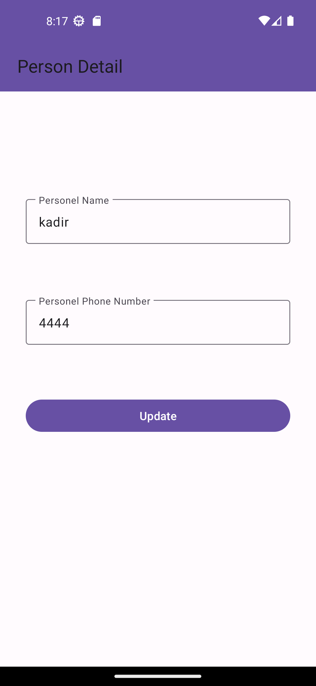

# ContactsApp
A contacts app with android kotlin
<h1> Version 1.0 </h1>
Version one user interface was also designed. Navigation Component was installed and the link between the pages was established. Then, by adding the "safe argument" library, a connection was established between the fragments for data movement, and data movement tests were performed.

  
  
  

